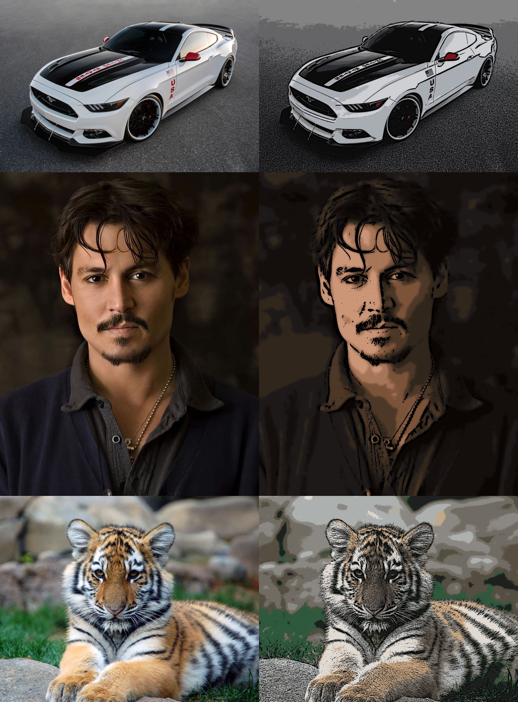

# image-to-sketch
it's basic machine learning project which is used to convert any image into relative sketch type image.

it was build using ___python___ and for operations on images ___OpenCV___ Framework was used. for color quantization part ___K-Means clustering___ Machine learning algorithm was used

steps involed in this process:
1. [read image [using OpenCV]](#read-image-and-grayscale-convertion)
2. [grayscale conversion](#read-image-and-grayscale-convertion)
3. [edge masking](#color-quantization)
4. [color quantization [using K Means]](#edge-masking)
5. [noise reduction using Bilateral filter](#noise-reduction)
6. [combining edge mask and reconstructed color image](#applying-mask-on-colored-image)
7. [write resultant image in output folder](#end-results)

## read image and grayscale convertion 
firstly we read an input image using OpenCV and convert into __Grayscale image__.

[Note: OpenCV uses BGR color schem by default] 
## edge masking
To create a sketch-type effect, we emphasize the thickness of the edges in an image. to do so we extract the edges of the image.

## color quantization 
in this part we set how many number of distinct colors we can use to make image look more like an _sketch image_   here we can apply the __K-Means clustering algorithm__ which can be used to adjust number of colors to be selected by selecting an optimal value of K in the algorithm.

## noise reduction 
after performing color quantization, the noise present in the image should be reduce. 
This would make image little blurred and reduce the sharpness to eliminate some noise. also it would help to achive more accurate sketch type image.

[Note: output from this phase may look same as input but it helps in next phase while applying mask]
## applying mask on colored image
in the end we apply edge mask on the colored image to achive our complete sketch image.

## end results
orignal image with respect to output sketch image.

### sample Examples  

